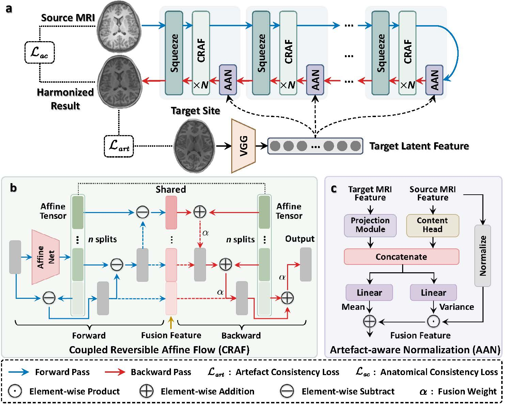

# CRAFT

Official PyTorch implementation of **CRAFT: Coupled Reversible Affine Flow with Target Guidance for Unpaired Multimodal MRI Acquisition Translation**.



## Overview

CRAFT is an unpaired multimodal MRI acquisition translation framework that combines coupled reversible affine flows with target-guided acquisition-aware normalization to incorporate target acquisition characteristics while preserving source anatomy.

## Installation

Install the project dependencies:

```bash
pip install -r requirements.txt
```

For GPU training, install the PyTorch build that matches your CUDA environment before installing the remaining dependencies.

The perceptual losses require pretrained VGG encoder weights at:

```text
model/losses/vgg_model/vgg_normalised.pth
```

The weights are included in this repository. If they are removed from a redistributed copy, restore them at the path above before training or evaluation.

## Quick Start

Run a minimal forward-and-backward smoke test on CPU:

```bash
python tools/smoke_test.py --config configs/debug.yaml --device cpu
```

Run the one-step debug configuration:

```bash
python main.py --config configs/debug.yaml --device cpu
```

## Training

Single-GPU training:

```bash
python main.py --config configs/config.yaml --device cuda
```

Multi-GPU training:

```bash
torchrun --nproc_per_node=4 main.py --config configs/config.yaml
```

Training artifacts, checkpoints, and evaluation results are written to the output directory configured in the selected YAML file.

## Evaluation

Evaluate a trained checkpoint:

```bash
python main.py \
  --config configs/config.yaml \
  --eval-only \
  --load-path output_dir/harmonization/model_save/final.ckpt.pth.tar
```

This implementation is based on [WeichenFan/HierarchyFlow](https://github.com/WeichenFan/HierarchyFlow) and extends it to the MRI harmonization setting.
