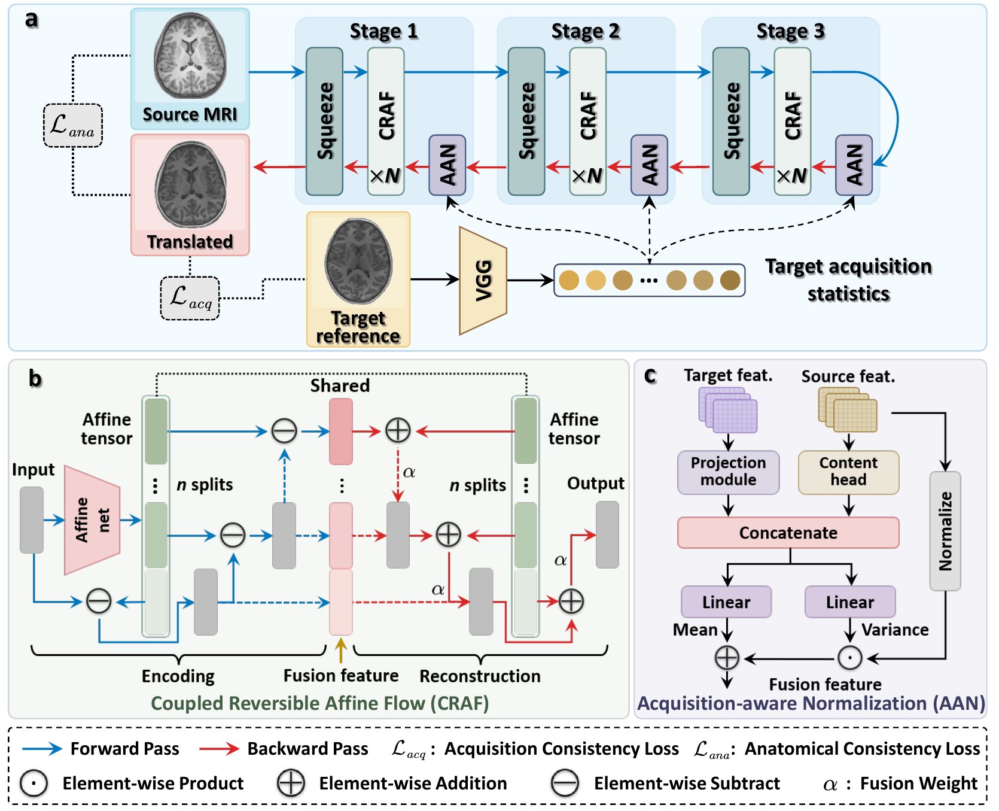

# CRAFT

PyTorch implementation of **CRAFT: Coupled Reversible Affine Flow with Target Guidance for Unpaired Multimodal MRI Acquisition Translation**. *Manuscript in preparation for submission.*

CRAFT translates MRI acquisition characteristics using unpaired source images and target references while preserving source anatomy. It combines coupled reversible affine flows (CRAF) with acquisition-aware normalization (AAN), guided by anatomical and acquisition consistency objectives.



*Figure 1. CRAFT framework, coupled reversible affine flow (CRAF), and acquisition-aware normalization (AAN). Target acquisition statistics guide source-feature modulation and image reconstruction.*

## Dependencies

Use Python 3.10 or newer. Dependencies include PyTorch (>=1.13), torchvision (>=0.14), NumPy, Pillow, PyYAML, and TensorBoard:

```bash
pip install -r requirements.txt
```

For GPU training, install matching PyTorch and torchvision builds for your CUDA environment. The fixed VGG encoder used by the losses is included at `model/losses/vgg_model/vgg_normalised.pth`; retain this file when copying the repository.

## Training and Testing

### Data preparation

The released loader reads 2D image slices (such as PNG files), converts them to RGB, and resizes them according to the configuration. Convert NIfTI volumes to slices before using this loader.

Create separate source and target file lists with one image path per line. Configure `dataset.train` and `dataset.test` in `configs/config.yaml`, including `source_list`, `target_list`, `source_root`, `target_root`, image dimensions, and batch size. The provided lists reference example HUH and COI slice paths; supply your own images or replace the lists. Set `dataset.train.random_pair: true` if you want independently sampled source-target pairs.

Run commands from the repository root.

### Training

```bash
# Single GPU
python main.py --config configs/config.yaml --device cuda

# Multiple GPUs (adjust the process count to your available GPUs)
torchrun --nproc_per_node=4 main.py --config configs/config.yaml
```

Adjust `train.max_steps`, `optimizer.lr`, and dataset batch sizes in the YAML file. Use `--max-steps` and `--num-workers` for command-line overrides. Training saves checkpoints under `output_dir/harmonization/model_save/` with the default configuration; the final checkpoint is `final.ckpt.pth.tar`.

After preparing the image paths, a small CPU check is available:

```bash
python tools/smoke_test.py --config configs/debug.yaml --device cpu
```

### Testing

Evaluate your trained checkpoint using the configured test source images and target references:

```bash
python main.py --config configs/config.yaml --eval-only --load-path output_dir/harmonization/model_save/final.ckpt.pth.tar
```

Predictions are saved to `output_dir/harmonization/eval_results/pred/`, and comparison images to `output_dir/harmonization/eval_results/cat_img/`. These paths follow the YAML `output` and `task_name` settings. No trained CRAFT checkpoint is provided.

## Acknowledgement

This implementation is based on [HierarchyFlow](https://github.com/WeichenFan/HierarchyFlow) by Weichen Fan, Jinghuan Chen, and Ziwei Liu, and adapts it to unpaired MRI acquisition translation. We thank the authors for sharing their code and the maintainers of the open-source libraries used in this project. See [THIRD_PARTY_NOTICES.md](THIRD_PARTY_NOTICES.md) for attribution details.

## Citation

This work is a manuscript in preparation for submission. If you use this implementation, please cite:

```bibtex
@misc{zhu2026craft,
  title  = {{CRAFT}: Coupled Reversible Affine Flow with Target Guidance for Unpaired Multimodal {MRI} Acquisition Translation},
  author = {Zhu, Pengli and Pang, Haowen and Zhu, Yitao and Hao, Yingqi},
  year   = {2026},
  note   = {Manuscript in preparation for submission},
  url    = {https://github.com/Idea89560041/CRAFT}
}
```
